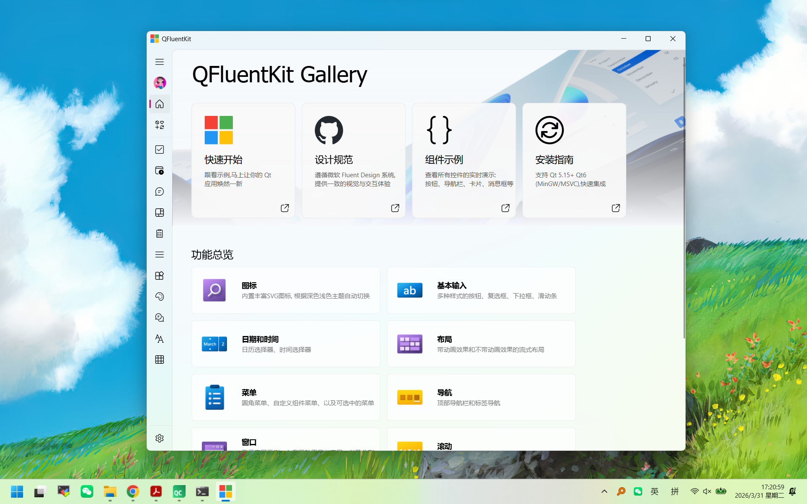
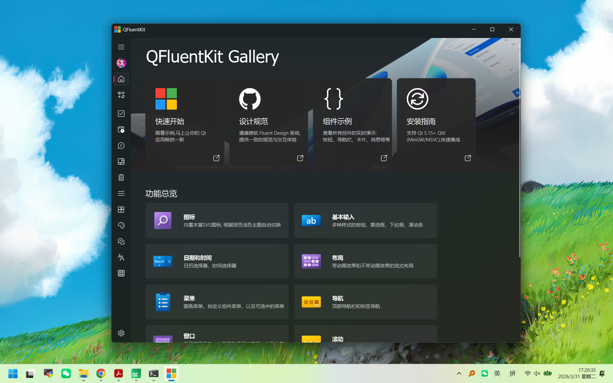

# QFluentKit

<div align="center">

A beautiful and modern Qt Fluent Design component library with 90+ high-quality out-of-the-box components

<p align="center">
<a href="README.md">English</a> | <a href="README_ZH.md">简体中文</a>
</p>

[](LICENSE)
[](https://www.qt.io/)
[](https://github.com/toddming/QFluentKit)

</div>

---

## Introduction

**QFluentKit** is a Qt-based Fluent Design style component library that provides a complete collection of modern UI components. The project adopts the C++17 standard, supports both Qt5/Qt6 versions, and is compatible with Windows, Linux, and macOS platforms.





### Key Features

- 🎨 **Fluent Design Style** - Modern Microsoft Fluent Design UI specifications
- 🌓 **Dark/Light Theme** - Automatic theme switching with custom theme color support
- 🧩 **90+ Advanced Components** - Covering input, display, layout, dialogs, and complete scenarios
- 🦦 **Qt5/Qt6 Dual Support** - One codebase, fully compatible with both versions
- 🖥️ **Cross-Platform** - Windows, Linux, macOS support
- 📦 **Easy Integration** - Dynamic library format with simple CMake integration
- 🎭 **Rich Animation Effects** - Multiple built-in smooth animation systems
- 🎭 **Acrylic Material Effect** - Support for Windows acrylic frosted glass effect

---

## System Support

| Platform | Support Status | Remarks |
|----------|----------------|---------|
| Windows 10/11 | ✅ Full Support | Recommended, best experience |
| Linux | ✅ Supported | Qt5/Qt6 both available |
| macOS | ✅ Supported | Qt5/Qt6 both available |

---

## Requirements

### Qt Version
- **Qt 5.12** or higher
- **Qt 6.x** fully supported

### Compiler
| Platform | Recommended Compiler |
|----------|---------------------|
| Windows | MinGW 8.0+ or MSVC 2017+ |
| Linux | GCC 7+ or Clang 5+ |
| macOS | Clang (Xcode 10+) |

### Dependencies
- **CMake** 3.15+
- **Qt Modules**: Core, Widgets, Svg, Xml

---

## Quick Start

### 1. Clone the Repository

```bash
git clone https://github.com/toddming/QFluentKit.git
cd QFluentKit
```

### 2. Build the Project

#### Windows (MinGW)

```bash
mkdir build && cd build
cmake -G "MinGW Makefiles" ..
mingw32-make
```

#### Windows (MSVC)

```bash
mkdir build && cd build
cmake ..
cmake --build . --config Release
```

#### Linux/macOS

```bash
mkdir build && cd build
cmake ..
make -j$(nproc)
```

Run the example program:

```bash
cd build/QFluentExample
./QFluentExample    # Linux/macOS
QFluentExample.exe  # Windows
```

**Note:** The `MinimalExample` project is only built when QFluent is already installed (detected via `find_package(QFluent)`). This allows testing the installed library integration.

---

## Integration into Your Project

### Method 1: Install to Qt Directory (Recommended)

Installing QFluentKit to your Qt installation directory allows all Qt projects to use it seamlessly.

#### Step 1: Build and Install

**Windows (MSVC)**
```bash
mkdir build && cd build
cmake -G "Visual Studio 17 2022" -A x64 -DQFLUENT_INSTALL_TO_QT=ON ..
cmake --build . --config Release
cmake --install . --config Release
```

**Windows (MinGW)**
```bash
mkdir build && cd build
cmake -G "MinGW Makefiles" -DQFLUENT_INSTALL_TO_QT=ON ..
mingw32-make
mingw32-make install
```

**Linux/macOS**
```bash
mkdir build && cd build
cmake -DQFLUENT_INSTALL_TO_QT=ON ..
make -j$(nproc)
sudo make install
```

#### Step 2: Use in Your Project

After installation, simply add to your `CMakeLists.txt`:

```cmake
find_package(QFluent REQUIRED)
target_link_libraries(MyApp PRIVATE QFluent::QFluent)
```

#### Installation Structure

After installation, files are organized as follows (taking Qt 6.8.3 MSVC as example):

```
E:/Qt/6.8.3/msvc2022_64/
├── bin/
│   ├── QFluent.dll           # Release DLL
│   ├── QFluentd.dll          # Debug DLL (with 'd' suffix)
│   ├── QFluent.pdb           # Debug PDB (MSVC only)
│   ├── QFluent.dll.debug     # Debug symbols (MinGW only)
│   └── ...
├── lib/
│   ├── QFluent.lib           # Release import library
│   ├── QFluentd.lib          # Debug import library (with 'd' suffix)
│   └── cmake/
│       └── QFluent/          # CMake config files
│           ├── QFluentConfig.cmake
│           ├── QFluentConfigVersion.cmake
│           └── QFluentTargets.cmake
├── include/
│   └── QFluent/              # Header files
│       ├── FluentGlobal.h
│       ├── Theme.h
│       ├── FluentIcon.h
│       └── ...
└── share/
    └── QFluent/
        └── res/              # Resource files (icons, stylesheets)
```

**Note:**
- Debug libraries use the `d` suffix (e.g., `QFluentd.dll`, `QFluentd.lib`), following Qt's convention. This allows Debug and Release versions to coexist in the same directory.
- MSVC: Debug PDB files are installed alongside the DLLs for debugging.
- MinGW: Debug symbols are extracted to separate `.debug` files (e.g., `QFluent.dll.debug`) to reduce DLL size while maintaining debugging capability.

### Method 2: Install to Custom Directory

You can also install to a custom location:

```bash
mkdir build && cd build
cmake -DCMAKE_INSTALL_PREFIX=/path/to/install ..
cmake --build . --config Release
cmake --install . --config Release
```

Then in your project, specify the installation path:

```cmake
# Add to CMAKE_PREFIX_PATH
set(CMAKE_PREFIX_PATH "/path/to/install/lib/cmake/QFluent;${CMAKE_PREFIX_PATH}")
find_package(QFluent REQUIRED)
target_link_libraries(MyApp PRIVATE QFluent::QFluent)
```

Or set `QFluent_DIR`:

```cmake
set(QFluent_DIR "/path/to/install/lib/cmake/QFluent")
find_package(QFluent REQUIRED)
target_link_libraries(MyApp PRIVATE QFluent::QFluent)
```

### Method 3: Subdirectory Integration

Add QFluentKit as a subdirectory in your project:

```cmake
# Add QFluentKit subdirectory
add_subdirectory(QFluentKit)

# Link QFluent
target_link_libraries(MyApp PRIVATE QFluent)
```

### Method 4: Manual Integration

1. Build QFluentKit to generate `QFluent.dll` (Windows) or `libQFluent.so` (Linux/macOS)
2. Include the header directory in your project: `QFluentKit/QFluent/src/`
3. Link the generated library file

### CMake Options

| Option | Default | Description |
|--------|---------|-------------|
| `QFLUENT_INSTALL_TO_QT` | ON | Install to Qt installation directory |
| `CMAKE_INSTALL_PREFIX` | System default | Custom installation path |
| `BUILD_QWINDOWKIT` | OFF | Enable QWindowKit integration |

### Optional: Enable QWindowKit Integration

QWindowKit provides advanced window management features (frameless windows, frosted glass effect, etc.):

```cmake
# Enable when building the example program
set(BUILD_QWINDOWKIT ON CACHE BOOL "Build with QWindowKit support" FORCE)

# Or enable via CMake parameter
cmake -DBUILD_QWINDOWKIT=ON ..
```

Once enabled, the `USE_QWINDOWKIT` macro will be defined, allowing access to enhanced window features.

---

## Basic Usage

### Hello World

```cpp
#include <QWidget>
#include <QApplication>

#include "QFluent/LineEdit.h"
#include "QFluent/PushButton.h"

int main(int argc, char *argv[])
{
    QApplication app(argc, argv);

    // Create a Fluent window
    QWidget window;
    window.setWindowTitle("QFluentKit Example");
    window.resize(800, 600);

    // Create a button
    auto *button = new PrimaryPushButton(&window);
    button->setText("Click Me");
    button->move(350, 280);

    // Create a line edit
    auto *lineEdit = new LineEdit(&window);
    lineEdit->setPlaceholderText("Please enter content...");
    lineEdit->move(350, 340);

    window.show();
    return app.exec();
}

```

---

## Component List

### Basic Input
- Button, PrimaryButton, HyperlinkButton
- CheckBox, RadioButton
- ComboBox, LineEdit, Slider, SpinBox
- SwitchButton, PushButton

### Display Components
- Label, CaptionLabel, StrongLabel
- ImageLabel, IconWidget
- CardWidget, Loading

### Date and Time
- DatePicker, TimePicker
- CalendarPicker, CalendarView
- CycleListWidget

### Menu and Navigation
- RoundMenu, NavigationPanel, NavigationBar
- Pivot, TabBar

### Dialogs
- MessageDialog, ColorDialog, Flyout, TeachingTip

### Container and Layout
- StackedWidget, ScrollArea, TableView
- ListView, FlowLayout, ExpandLayout

### Progress and Status
- ProgressBar, ProgressRing
- IndeterminateProgressBar, IndeterminateProgressRing
- InfoBar, ToolTip

### Setting Cards
- SettingCard, SettingCardGroup
- ExpandSettingCard, OptionsSettingCard

### Material Effects
- AcrylicWidget, AcrylicLabel, AcrylicMenu, AcrylicToolTip

---

## Project Structure

```
QFluentKit/
├── QFluent/                      # Core dynamic library
│   ├── src/
│   │   ├── FluentGlobal.h        # Global enumerations (ThemeMode, IconType, ThemeStyle)
│   │   ├── Theme.h               # Theme management system (AUTO/LIGHT/DARK)
│   │   ├── Router.h              # Routing system (works with StackedWidget)
│   │   ├── FluentIcon.h          # Icon system (248+ built-in SVG icons)
│   │   ├── StyleSheet.h          # Stylesheet management system
│   │   ├── Animation.h           # Animation system base class
│   │   ├── QFluent/              # Public component headers
│   │   │   ├── BasicInput/       # Basic input components
│   │   │   ├── Display/          # Display components
│   │   │   ├── DateTime/         # Date and time components
│   │   │   ├── Menu/             # Menu components
│   │   │   ├── Dialog/           # Dialogs
│   │   │   ├── Layout/           # Layout containers
│   │   │   ├── Progress/         # Progress components
│   │   │   ├── Setting/          # Setting cards
│   │   │   └── Material/         # Material effects
│   │   └── Private/              # PIMPL private implementation
│   └── res/                      # Resource files
│       ├── images/icons/         # Fluent Design SVG icons
│       └── style/                # QSS stylesheets (light/dark)
├── QFluentExample/                # Example application
│   ├── src/
│   │   ├── Interface/            # 15 demo interfaces
│   │   │   ├── HomeInterface.h
│   │   │   ├── BasicInputInterface.h
│   │   │   └── ...
│   │   └── Window/               # Custom window examples
│   │       ├── LoginWindow.h
│   │       ├── NavbarWindow.h
│   │       └── SplitWindow.h
│   └── libs/qwindowkit/          # Optional window management library
├── CMakeLists.txt                 # Root CMake configuration
└── README.md
```

---

## License

This project is open source under the [GPLv3](LICENSE) license.

---

## Contributing

Issues and Pull Requests are welcome!

---

## Acknowledgments

- Core window management: [QWindowKit](https://github.com/stdware/qwindowkit)
- Design inspiration from: [PyQt-Fluent-Widgets](https://github.com/zhiyiYo/PyQt-Fluent-Widgets)

---

<div align="center">

⭐ If you find this project helpful, please give it a Star!

</div>